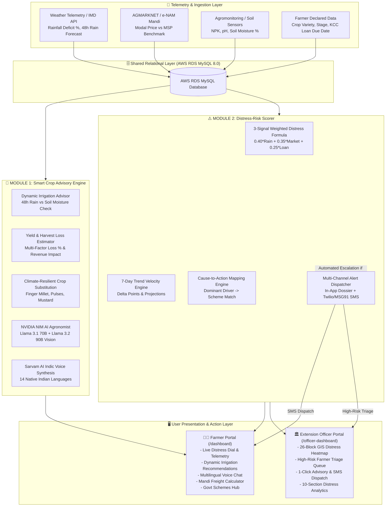
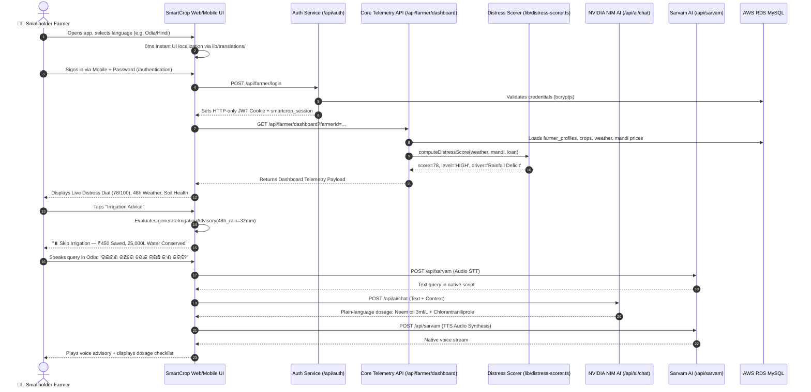
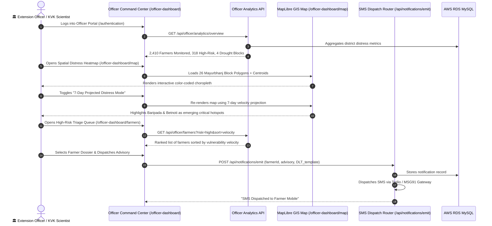
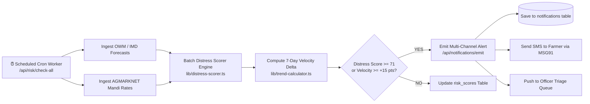

# 🌱 SmartCrop — Comprehensive System Workflow, Mathematical Formulations, APIs & AI/ML Architecture

> **Production-grade, Multilingual Crop Advisory & Farmer Distress Early-Warning System**  
> Built for **Smart India Hackathon (SIH)** — **Problem Statement PS-02**.

---

## 📑 Table of Contents

1. [Executive Architecture & Dual-Module Paradigm](#1-executive-architecture--dual-module-paradigm)
2. [Entity Operational Journeys & Execution Flows](#2-entity-operational-journeys--execution-flows)
   - [A. Smallholder Farmer Journey](#a-smallholder-farmer-journey)
   - [B. Agriculture Extension Officer Journey](#b-agriculture-extension-officer-journey)
   - [C. District Administrator & Policy Maker Journey](#c-district-administrator--policy-maker-journey)
   - [D. Autonomous Background Daemon & Cron Scheduler](#d-autonomous-background-daemon--cron-scheduler)
3. [Mathematical Formulations, Algorithms & Scientific Heuristics](#3-mathematical-formulations-algorithms--scientific-heuristics)
   - [Formula 1: 3-Signal Composite Distress Risk Score](#formula-1-3-signal-composite-distress-risk-score)
   - [Formula 2: Erratic Rainfall Deficit & Scaled Weather Risk](#formula-2-erratic-rainfall-deficit--scaled-weather-risk)
   - [Formula 3: Mandi Price Crash & Scaled Market Risk](#formula-3-mandi-price-crash--scaled-market-risk)
   - [Formula 4: Loan Due-Date Proximity Risk Function](#formula-4-loan-due-date-proximity-risk-function)
   - [Formula 5: Dynamic Irrigation Decision Heuristic & Economic Savings](#formula-5-dynamic-irrigation-decision-heuristic--economic-savings)
   - [Formula 6: Multi-Stress Yield & Harvest Loss Estimator](#formula-6-multi-stress-yield--harvest-loss-estimator)
   - [Formula 7: 7-Day Velocity & Trend Projection Delta](#formula-7-7-day-velocity--trend-projection-delta)
   - [Formula 8: Net Realized Mandi Price & Freight Calculation](#formula-8-net-realized-mandi-price--freight-calculation)
4. [External & Internal APIs — Specifications & Codebase Location](#4-external--internal-apis--specifications--codebase-location)
   - [API 1: NVIDIA NIM Model Gateway](#api-1-nvidia-nim-model-gateway)
   - [API 2: Sarvam AI Indic Speech & NLP API](#api-2-sarvam-ai-indic-speech--nlp-api)
   - [API 3: OpenWeatherMap & Agromonitoring Weather Telemetry](#api-3-openweathermap--agromonitoring-weather-telemetry)
   - [API 4: AGMARKNET Mandi Price Ingestion API](#api-4-agmarknet-mandi-price-ingestion-api)
   - [API 5: Fast2SMS (Primary) & MSG91 (Fallback) SMS Advisory Dispatch Gateway](#api-5-fast2sms-primary--msg91-fallback-sms-advisory-dispatch-gateway)
   - [API 6: AWS RDS MySQL 8.0 Cloud Database](#api-6-aws-rds-mysql-80-cloud-database)
5. [AI & Machine Learning Engineering Deep-Dive](#5-ai--machine-learning-engineering-deep-dive)
   - [Model Selection & Multi-Model Fallback Hierarchy](#model-selection--multi-model-fallback-hierarchy)
   - [Prompt Engineering & Context Injection Pipeline](#prompt-engineering--context-injection-pipeline)
   - [Multimodal Leaf Pathology & Disease Diagnosis (VLM)](#multimodal-leaf-pathology--disease-diagnosis-vlm)
   - [Indic Speech Synthesis & Voice Recognition (STT/TTS)](#indic-speech-synthesis--voice-recognition-stttts)
   - [Deterministic Rule Engine Fallback Architecture](#deterministic-rule-engine-fallback-architecture)
6. [Complete Codebase Map & Endpoint Directory](#6-complete-codebase-map--endpoint-directory)

---

## 1. Executive Architecture & Dual-Module Paradigm

SmartCrop addresses the **Smart India Hackathon Problem Statement PS-02** through a tightly coupled dual-module software architecture:



---

## 2. Entity Operational Journeys & Execution Flows

### A. Smallholder Farmer Journey



#### Detailed Steps for Farmer:
1. **Onboarding & GPS Verification (`/onboarding`)**: Farmer enters basic details (name, village, phone), selects registered crop (e.g. Swarna Paddy), plot acreage (2.5 acres), soil type, and self-declares KCC loan due date.
2. **Daily Command Center (`/dashboard`)**: Instant view of the **Distress Dial** ($0-100$), today's temperature, soil moisture status, crop phenological stage progress (e.g., Day 54 of 120 - Panicle Initiation), and active alerts.
3. **Dynamic Irrigation Advisor (`/crop-monitoring`)**: Advises whether to turn on the water pump today or skip based on 48h forecasted precipitation, calculating exact financial savings in ₹ and water conserved in Liters.
4. **Interactive AI Voice Agronomist (`/ai-chat` & Floating Bot)**: Draggable, green blur transparent floating bot for 24/7 agricultural Q&A with voice input/output in 14 languages.
5. **Crop Leaf Disease Diagnosis (`/ai-chat` & Photo Upload)**: Camera photo upload of infected crop leaf; vision model diagnoses disease (e.g., Brown Spot, Blast) and prescribes chemical/organic treatments with per-acre dilution rates.
6. **Mandi Market Freight Calculator (`/market`)**: Real-time modal price across nearest 5 APMC mandis vs MSP, factoring in diesel haulage costs and mandi cess to calculate true net realization per quintal.
7. **Government Schemes Discovery (`/schemes`)**: Matches farmer's land size and distress profile to eligible central and state schemes (PMFBY, PM-KUSUM, KALIA, DBT Agriculture) with document checklists.

---

### B. Agriculture Extension Officer Journey



#### Detailed Steps for Agriculture Officer:
1. **Executive Overview Dashboard (`/officer-dashboard`)**: District-wide macro telemetry: Total registered farmers, high-risk distress count, weather warning count, and average block distress index.
2. **26-Block GIS Spatial Heatmap (`/officer-dashboard/map`)**: GPU-accelerated MapLibre GL map showing real-time distress distribution across all 26 administrative blocks of Mayurbhanj district.
3. **7-Day Trend Velocity Projection**: Toggle switches heatmap and triage queues to projected distress trajectories ($\text{Score}_{t+7}$) based on rolling 7-day weather and market stress rates.
4. **Vulnerability Triage Queue (`/officer-dashboard/farmers`)**: Searchable, filterable list of farmers sorted by distress score, dominant driver (Drought vs Price vs Debt), and velocity delta.
5. **Individual Farmer Diagnostic Dossier (`/officer-dashboard/farmers/[id]`)**: Comprehensive farm record: Soil NPK levels, satellite NDVI, crop phenology, debt profile, and past advisory history.
6. **1-Click Field Intervention & SMS Dispatch (`/officer-dashboard/interventions`)**: Dispatches localized SMS alerts directly to rural farmers' feature phones in their native language and logs extension field visits.
7. **10-Section Analytics Suite (`/officer-dashboard/analytics`)**: Deep statistical breakdowns including Market Stress vs MSP, Weather Deficit Matrix, Risk Distribution Bands, and Compound Risk Cross-Tabulation.

---

### C. District Administrator & Policy Maker Journey

```mermaid
flowchart TD
    Admin[🏛️ District Magistrate / Director of Agriculture] --> Dash[/officer-dashboard/analytics]
    Dash --> KPI[District Macro KPIs\nTotal Cultivated Area, Hectarage at Risk, Est. Economic Loss]
    Dash --> Heatmap[26-Block GIS Heatmap\nIdentify Drought-Prone Blocks]
    Dash --> MarketStress[Mandi Volatility Panel\nTrack Mandi Prices Falling >20% Below MSP]
    
    Heatmap -->|Blocks with Deficit >= 40%| DroughtDecl[Initiate Official Drought Relief Notification]
    MarketStress -->|PACS Token Delay Identified| MarketIntervene[Authorize Emergency PACS Procurement Tokens]
    KPI -->|KCC Repayment Spike| CreditRelief[Coordinate with Lead District Bank for Loan Moratorium]
```

---

### D. Autonomous Background Daemon & Cron Scheduler



---

## 3. Mathematical Formulations, Algorithms & Scientific Heuristics

### Formula 1: 3-Signal Composite Distress Risk Score

The core distress-risk engine ([`lib/distress-scorer.ts`](file:///c:/Users/sugud/OneDrive/Documents/SIH/lib/distress-scorer.ts)) synthesizes three orthogonal agricultural hazard signals into a normalized composite index $S \in [0, 100]$:

$$\boxed{S = (W_{\text{rain}} \cdot R_{\text{rain}}) + (W_{\text{mkt}} \cdot R_{\text{mkt}}) + (W_{\text{loan}} \cdot R_{\text{loan}})}$$

Where the deterministic regulatory weights mandated by **PS-02** are:
- $W_{\text{rain}} = 0.40$ (40% weight to erratic weather & precipitation deficits)
- $W_{\text{mkt}} = 0.35$ (35% weight to mandi price crash relative to Government MSP)
- $W_{\text{loan}} = 0.25$ (25% weight to KCC credit repayment due-date proximity)
- Note: $\sum W_i = 0.40 + 0.35 + 0.25 = 1.00$

```
Code Location: lib/distress-scorer.ts (Lines 112-117)
Endpoint: GET /api/farmer/risk
```

---

### Formula 2: Erratic Rainfall Deficit & Scaled Weather Risk

Calculates the percentage deficit of precipitation relative to historical seasonal normal:

$$\text{Deficit}_{\text{rain}}\% = \max\left(0, \min\left(100, \left\lfloor \frac{P_{\text{expected}} - P_{\text{actual}}}{P_{\text{expected}}} \times 100 \right\rceil\right)\right)$$

The raw deficit is mapped to a non-linear scaled hazard score $R_{\text{rain}} \in [0, 100]$:

$$R_{\text{rain}} = \begin{cases} 
\min\left(100, 75 + \lfloor (\text{Deficit}_{\text{rain}} - 50) \times 0.50 \rceil\right), & \text{if } \text{Deficit}_{\text{rain}} \ge 50\% \\
40 + \lfloor (\text{Deficit}_{\text{rain}} - 20) \times 1.15 \rceil, & \text{if } 20\% \le \text{Deficit}_{\text{rain}} < 50\% \\
\lfloor \text{Deficit}_{\text{rain}} \times 2.00 \rceil, & \text{if } \text{Deficit}_{\text{rain}} < 20\%
\end{cases}$$

```
Code Location: lib/distress-scorer.ts (Lines 55-70)
Used in: Dashboard Dial, Risk Breakdown, Weather Stress Panel
```

---

### Formula 3: Mandi Price Crash & Scaled Market Risk

Measures the percentage crash of local APMC mandi modal price ($P_{\text{mandi}}$) below the Government Minimum Support Price ($P_{\text{MSP}}$):

$$\text{Crash}_{\text{mkt}}\% = \max\left(0, \min\left(100, \left\lfloor \frac{P_{\text{MSP}} - P_{\text{mandi}}}{P_{\text{MSP}}} \times 100 \right\rceil\right)\right)$$

The price crash percentage is mapped to a scaled market hazard score $R_{\text{mkt}} \in [0, 100]$:

$$R_{\text{mkt}} = \begin{cases} 
\min\left(100, 70 + \lfloor (\text{Crash}_{\text{mkt}} - 25) \times 1.20 \rceil\right), & \text{if } \text{Crash}_{\text{mkt}} \ge 25\% \\
40 + \lfloor (\text{Crash}_{\text{mkt}} - 10) \times 2.00 \rceil, & \text{if } 10\% \le \text{Crash}_{\text{mkt}} < 25\% \\
\lfloor \text{Crash}_{\text{mkt}} \times 4.00 \rceil, & \text{if } \text{Crash}_{\text{mkt}} < 10\%
\end{cases}$$

```
Code Location: lib/distress-scorer.ts (Lines 72-85)
Used in: Market Intelligence Page, Officer Market Stress Analytics
```

---

### Formula 4: Loan Due-Date Proximity Risk Function

Measures the temporal pressure of self-declared Kisan Credit Card (KCC) or institutional debt:

$$D_{\text{rem}} = \left\lceil \frac{T_{\text{due}} - T_{\text{current}}}{86400 \times 1000} \right\rceil \text{ days}$$

$$R_{\text{loan}} = \begin{cases} 
95, & \text{if } D_{\text{rem}} \le 0 \text{ (Overdue Default Risk)} \\
90, & \text{if } 1 \le D_{\text{rem}} \le 7 \text{ (Critical Week Horizon)} \\
75, & \text{if } 8 \le D_{\text{rem}} \le 15 \text{ (Fortnight Buffer)} \\
55, & \text{if } 16 \le D_{\text{rem}} \le 30 \text{ (Monthly Horizon)} \\
35, & \text{if } 31 \le D_{\text{rem}} \le 60 \text{ (Moderate Horizon)} \\
15, & \text{if } D_{\text{rem}} > 60 \text{ (Comfortable Baseline)}
\end{cases}$$

```
Code Location: lib/distress-scorer.ts (Lines 87-110)
Used in: Farmer Risk Details, High-Risk Triage Queue
```

---

### Formula 5: Dynamic Irrigation Decision Heuristic & Economic Savings

Cross-references 48-hour rainfall forecast ($P_{48h}$) against current soil moisture ($M_{\text{soil}}\%$) and phenology stage:

$$\text{Irrigation Action} = \begin{cases} 
\textbf{SKIP}, & \text{if } P_{48h} \ge \theta_{\text{skip}} \quad (\theta_{\text{skip}} = 20\text{mm for Paddy}) \\
\textbf{IRRIGATE}, & \text{if } M_{\text{soil}} < 30\% \text{ and } P_{48h} < 10\text{mm} \\
\textbf{MONITOR}, & \text{otherwise}
\end{cases}$$

**Economic & Environmental Quantification**:
- **Pump Operating Cost Saved**: $\Delta C = ₹450 \times N_{\text{skips}}$ (for standard 5HP diesel pump on 2.5-acre parcel)
- **Groundwater Conserved**: $\Delta V = 25,000 \text{ Liters} \times N_{\text{skips}}$

```
Code Location: lib/irrigation-advisor.ts (Lines 35-80)
Used in: Farmer Dashboard, Crop Monitoring Calendar
```

---

### Formula 6: Multi-Stress Yield & Harvest Loss Estimator

Computes structured yield penalties and financial revenue loss:

$$L_{\text{weather}} = \min\left(50, \frac{\text{Deficit}_{\text{rain}}}{100} \times 45\right)$$

$$L_{\text{soil\_pest}} = \min\left(25, \left(\frac{S_{\text{soil}}}{100} \times 20\right) + \left(\frac{S_{\text{pest}}}{100} \times 10\right)\right)$$

$$L_{\text{market}} = \min\left(25, \frac{\text{Crash}_{\text{mkt}}}{100} \times 25\right)$$

$$\text{Projected Loss \%} = \min(85, L_{\text{weather}} + L_{\text{soil\_pest}} + L_{\text{market}})$$

$$\text{Risk-Adjusted Yield (qtl)} = Y_{\text{expected}} \times \left(1 - \frac{\text{Projected Loss \%}}{100}\right)$$

$$\text{Revenue Loss (₹)} = (Y_{\text{expected}} - \text{Risk-Adjusted Yield}) \times P_{\text{MSP}}$$

```
Code Location: lib/yield-estimator.ts (Lines 36-91)
Used in: Risk Diagnostics, Recommended Actions View
```

---

### Formula 7: 7-Day Velocity & Trend Projection Delta

Tracks the velocity of distress score escalation over a rolling 7-day window:

$$\Delta_{7d} = S_t - S_{t-7}$$

$$\text{Trend Direction} = \begin{cases} 
\textbf{rising}, & \text{if } \Delta_{7d} \ge +15 \text{ points} \\
\textbf{falling}, & \text{if } \Delta_{7d} \le -15 \text{ points} \\
\textbf{stable}, & \text{otherwise}
\end{cases}$$

**7-Day Forward Projection** (used on Officer Heatmap):

$$S_{\text{projected}} = \min(100, \max(0, S_t + \Delta_{7d}))$$

```
Code Location: lib/trend-calculator.ts (Lines 33-84)
Used in: Officer Triage Queue, 7-Day Projected Heatmap Mode
```

---

### Formula 8: Net Realized Mandi Price & Freight Calculation

Determines the true take-home revenue per quintal when choosing between local vs distant APMC mandis:

$$P_{\text{net}} = P_{\text{mandi}} - \left(\frac{D_{\text{km}} \times C_{\text{km}}}{Q_{\text{load}}}\right) - \left(P_{\text{mandi}} \times \mu_{\text{cess}}\right)$$

Where:
- $P_{\text{mandi}}$ = Modal price at destination mandi (₹/qtl)
- $D_{\text{km}}$ = One-way road distance to mandi (km)
- $C_{\text{km}}$ = Transport freight rate (default ₹18/km for mini-truck)
- $Q_{\text{load}}$ = Total haulage load in quintals (e.g., 30 quintals)
- $\mu_{\text{cess}}$ = Mandi market development cess (default 1.5% = 0.015)

```
Code Location: app/market/page.tsx, components/market/MandiComparator.tsx
Used in: Mandi Intelligence & Net Realization Calculator
```

---

## 4. External & Internal APIs — Specifications & Codebase Location

### API 1: NVIDIA NIM Model Gateway

- **Base URL**: `https://integrate.api.nvidia.com/v1`
- **Authentication**: `Bearer ${NVIDIA_API_KEY}`
- **Models Used**:
  - `meta/llama-3.1-70b-instruct`: High-speed agronomic text reasoning, dosage synthesis, and multilingual explanation.
  - `meta/llama-3.2-90b-vision-instruct`: Multimodal leaf photo inspection and pest pathology diagnosis.
  - `deepseek-ai/deepseek-v4-flash-0731`: Ultra-low-latency text generation fallback.
- **Code Location**: [`lib/nvidia-nim.ts`](file:///c:/Users/sugud/OneDrive/Documents/SIH/lib/nvidia-nim.ts)
- **Used by Endpoints**:
  - `POST /api/ai/chat`: Interactive chat & proactive agronomist bot.
  - `POST /api/ai/risk-explanation`: Converts numerical risk factors into plain-language actionable advice.
  - `POST /api/ai/diagnose-crop`: Analyzes base64 leaf photos for disease diagnosis.
  - `POST /api/ai/alternative-crop`: Evaluates climate-resilient alternative crop substitutions.

---

### API 2: Sarvam AI Indic Speech & NLP API

- **Base URL**: `https://api.sarvam.ai`
- **Authentication**: `api-subscription-key: ${SARVAM_API_KEY}`
- **Capabilities**:
  - **Speech-to-Text (STT)**: Transcribes spoken farmer queries across 14 Indic languages.
  - **Text-to-Speech (TTS)**: Synthesizes natural sounding Indic audio streams (`bulbul:v1` model).
- **Code Location**: [`lib/sarvam.ts`](file:///c:/Users/sugud/OneDrive/Documents/SIH/lib/sarvam.ts)
- **Used by Endpoints**:
  - `POST /api/sarvam`: Speech synthesis & voice transcription gateway.
  - `app/ai-chat/page.tsx`: Voice-in, voice-out AI agronomist interface.
  - `components/CropAudioPlayer.tsx`: Audio narration of crop production guides.

---

### API 3: OpenWeatherMap & Agromonitoring Weather Telemetry

- **Base URL**: `https://api.openweathermap.org/data/2.5`
- **Endpoints**:
  - `/forecast`: 5-day / 3-hour rainfall precipitation forecast.
  - `/weather`: Current temperature, humidity, wind speed, and atmospheric pressure.
- **Code Location**: [`app/api/farmer/dashboard/route.ts`](file:///c:/Users/sugud/OneDrive/Documents/SIH/app/api/farmer/dashboard/route.ts), [`app/api/officer/analytics/weather-stress/route.ts`](file:///c:/Users/sugud/OneDrive/Documents/SIH/app/api/officer/analytics/weather-stress/route.ts)
- **Data Extracted**:
  - `rain.3h` / `rain.1h`: Cumulative precipitation mm.
  - 48h forecasted precipitation sum (input to Dynamic Irrigation Advisor).
  - 14-day rainfall anomaly % (input to Distress Scorer).

---

### API 4: AGMARKNET Mandi Price Ingestion API

- **Base URL**: Government of India AGMARKNET Portal / Open Government Data (OGD)
- **Data Extracted**:
  - Commodity name (e.g. Paddy Common, Swarna, Maize, Ragi, Mustard).
  - Market / Mandi Center (e.g. Baripada, Betnoti, Rairangpur, Udala, Bahalda).
  - Modal Price, Min Price, Max Price (₹/quintal).
  - Official MSP Benchmark (e.g., Paddy Common MSP = ₹2,320/quintal for 2024–25).
- **Code Location**: [`app/api/market/prices/route.ts`](file:///c:/Users/sugud/OneDrive/Documents/SIH/app/api/market/prices/route.ts), [`app/api/officer/analytics/market-stress/route.ts`](file:///c:/Users/sugud/OneDrive/Documents/SIH/app/api/officer/analytics/market-stress/route.ts)

---

### API 5: Fast2SMS (Primary) & MSG91 (Fallback) SMS Advisory Dispatch Gateway

- **Primary Provider**: Fast2SMS Bulk V2 API (`https://www.fast2sms.com/dev/bulkV2`)
  - **Route**: `route=dlt` (TRAI/Indian Government DLT compliant regulatory transactional route).
  - **Required Headers / Parameters**:
    - `authorization`: `FAST2SMS_API_KEY` passed via HTTP header.
    - `route`: `'dlt'` (strict DLT mode; no free-text bypass).
    - `sender_id`: `FAST2SMS_SENDER_ID` (registered 6-character Header ID, e.g. `SMARTC`).
    - `message`: `FAST2SMS_DLT_TEMPLATE_ID` (approved DLT Template ID).
    - `entity_id`: `FAST2SMS_ENTITY_ID` (Principal Entity ID registered on operator DLT portal).
    - `numbers`: Plain 10-digit mobile number (automatically stripped of `+91` / `91` prefixes).
    - `variables_values`: Localized advisory text inserted into DLT template placeholders ($\le 160$ characters).
- **Automatic Fallback Provider**: MSG91 Flow API (`https://api.msg91.com/api/v5/flow/`)
  - **Trigger Condition**: If Fast2SMS dispatch fails (`return: false`, credit exhaustion, or 5xx/network error) and MSG91 credentials are configured, the system automatically retries dispatch once via MSG91 before marking the notification as `FAILED`.
- **Manual Overrides**: `SMS_PROVIDER=msg91` or `SMS_PROVIDER=twilio` or `SMS_PROVIDER=mock`.
- **Audit Logging**: Logs the actual delivering provider (`provider` column: `'fast2sms'`, `'msg91'`, `'twilio'`, or `'mock'`) and final delivery state (`status`: `'SENT'` or `'FAILED'`) in the `notifications` table.
- **Code Location**: [`lib/notifications/sms-service.ts`](file:///c:/Users/sugud/OneDrive/Documents/SIH/lib/notifications/sms-service.ts)
- **Trigger Points**:
  - Automated cron escalation when Distress Score $\ge 71$ (High Risk).
  - Manual 1-click advisory dispatch from Officer Triage Queue (`/officer-dashboard/farmers`).
  - Emergency disaster and weather warning fan-out (`/api/notifications/emit`).

---

### API 6: AWS RDS MySQL 8.0 Cloud Database

- **Host**: AWS RDS Multi-AZ MySQL 8.0 instance (`sih-mysql...rds.amazonaws.com`)
- **Connection Management**: Serverless MySQL connection pool with automatic keep-alive and statement timeouts.
- **Code Location**: [`lib/db.ts`](file:///c:/Users/sugud/OneDrive/Documents/SIH/lib/db.ts), [`lib/mysql.ts`](file:///c:/Users/sugud/OneDrive/Documents/SIH/lib/mysql.ts)
- **Key Tables**: `users`, `farmer_profiles`, `crops`, `risk_scores`, `mandi_prices`, `weather_observations`, `ai_recommendations`, `government_schemes`, `officer_interventions`, `notifications`.

---

## 5. AI & Machine Learning Engineering Deep-Dive

### Model Selection & Multi-Model Fallback Hierarchy

SmartCrop executes a **zero-downtime, resilient AI orchestration pipeline**:

```
                  ┌──────────────────────────────────────────────┐
                  │          Inbound AI Request Trigger          │
                  │   (/api/ai/chat, /risk-explanation, etc.)    │
                  └──────────────────────┬───────────────────────┘
                                         │
                                         ▼
                  ┌──────────────────────────────────────────────┐
                  │    Primary: NVIDIA NIM Llama-3.1-70B-Inst    │
                  │         (integrate.api.nvidia.com)           │
                  └──────────────┬───────────────────────────────┘
                                 │
                        Success? ├── YES ──► Return AI Response
                                 │
                                 └── NO (Timeout / Quota / 5xx)
                                 │
                                 ▼
                  ┌──────────────────────────────────────────────┐
                  │    Secondary: NVIDIA NIM Llama-3.2-11B-Vis   │
                  └──────────────┬───────────────────────────────┘
                                 │
                        Success? ├── YES ──► Return AI Response
                                 │
                                 └── NO
                                 │
                                 ▼
                  ┌──────────────────────────────────────────────┐
                  │   Tertiary: DeepSeek V4 Flash AI (NIM)       │
                  └──────────────┬───────────────────────────────┘
                                 │
                        Success? ├── YES ──► Return AI Response
                                 │
                                 └── NO
                                 │
                                 ▼
                  ┌──────────────────────────────────────────────┐
                  │  Deterministic Rule-Based Agronomic Fallback │
                  │     (100% Guaranteed Scientific Response)    │
                  └──────────────────────────────────────────────┘
```

---

### Prompt Engineering & Context Injection Pipeline

The system constructs high-precision, domain-specific agronomic prompts by injecting real-time telemetry into the system context:

```typescript
const systemPrompt = `
You are the SmartCrop AI Senior Agronomist serving smallholder farmers in India.
Current Farmer Context:
- Farmer Name: ${context.farmerName}
- Location: ${context.district}, Odisha (Agro-climatic Zone: North Eastern Plateau)
- Active Crop: ${context.cropName} (Variety: ${context.variety}, Stage: ${context.stage})
- Soil Telemetry: Moisture=${context.soilMoisture}%, pH=${context.soilPh}, NPK=${context.npk}
- Weather Signals: 14-day Rainfall Deficit = ${context.rainfallDeficit}%, 48h Forecast = ${context.forecast48h}mm
- Market Signals: Current Mandi Rate = ₹${context.mandiPrice}/qtl, MSP = ₹${context.msp}/qtl
- Distress Score: ${context.score}/100 (${context.riskLevel} Risk)

Guidelines:
1. Provide actionable, practical, plain-language agricultural directives.
2. Include exact dilution rates and per-acre chemical or organic dosages (e.g. 2% KNO3 foliar spray, 3ml/L neem oil).
3. Warn against unnecessary irrigation or spray before forecasted rainfall.
4. Respond in the farmer's selected language: ${context.languageName}.
`;
```

---

### Multimodal Leaf Pathology & Disease Diagnosis (VLM)

1. **Image Capture**: Farmer snaps a photo of diseased leaf/stem using mobile camera or file upload.
2. **Preprocessing**: Client compresses image to JPEG ($\le 2\text{MB}$) and encodes to base64 data URI.
3. **VLM Invocation**: Dispatched to `meta/llama-3.2-90b-vision-instruct` with structured JSON schema request.
4. **Diagnostic Output**:
   - **Disease / Pest Identified**: (e.g. *Pyricularia oryzae* — Rice Blast, Brown Spot, Yellow Stem Borer).
   - **Severity Level**: Mild (5–10%), Moderate (15–25%), Severe (>30%).
   - **Immediate Treatment**: Recommended fungicide/insecticide with exact concentration and safety withholding period.
   - **Organic Alternative**: Neem seed kernel extract (NSKE 5%) or *Trichoderma viride* biological control.

---

### Indic Speech Synthesis & Voice Recognition (STT/TTS)

- **STT Pipeline**: Audio recorded via `navigator.mediaDevices.getUserMedia` in WebM/WAV format $\to$ sent to Sarvam AI STT API $\to$ transcribed into native Indic script.
- **TTS Pipeline**: Text advisory translated into regional language $\to$ passed to Sarvam AI `bulbul:v1` engine $\to$ returned as 24kHz audio stream played through browser `AudioContext`.

---

## 6. Complete Codebase Map & Endpoint Directory

| Functional Component | Codebase File Location | Primary Technologies & APIs |
|:---|:---|:---|
| **Distress Scorer Engine** | [`lib/distress-scorer.ts`](lib/distress-scorer.ts) | TypeScript, 3-Signal Weighted Rule Formula |
| **Dynamic Irrigation Advisor** | [`lib/irrigation-advisor.ts`](lib/irrigation-advisor.ts) | 48h Rain vs Soil Moisture Heuristic Model |
| **Yield Loss Estimator** | [`lib/yield-estimator.ts`](lib/yield-estimator.ts) | Multi-Factor Yield Penalty & Revenue Calculator |
| **7-Day Velocity Engine** | [`lib/trend-calculator.ts`](lib/trend-calculator.ts) | Rolling Window Velocity & Projection Math |
| **NVIDIA NIM Gateway** | [`lib/nvidia-nim.ts`](lib/nvidia-nim.ts) | NVIDIA NIM API (Llama 3.1 70B & Llama 3.2 Vision) |
| **Sarvam AI Voice Engine** | [`lib/sarvam.ts`](lib/sarvam.ts) | Sarvam AI REST API (Indic STT & TTS) |
| **14 Indic Dictionaries** | [`lib/translations/`](lib/translations/) | Static TS Dictionaries (0ms Client Localization) |
| **Low-Bandwidth 2G Mode** | [`lib/bandwidth-context.tsx`](lib/bandwidth-context.tsx) | Network Information API, Zero-CLS Skeletons |
| **Draggable Floating Bot** | [`components/ProactiveAgronomistBot.tsx`](components/ProactiveAgronomistBot.tsx) | Pointer Events, Frosted Green Glassmorphism |
| **Farmer Dashboard** | [`app/dashboard/page.tsx`](app/dashboard/page.tsx) | Next.js Server/Client Component, Recharts |
| **Risk Details Page** | [`app/risk-details/page.tsx`](app/risk-details/page.tsx) | Multi-Factor Breakdown & AI Reasoning Section |
| **Mandi Price Intelligence** | [`app/market/page.tsx`](app/market/page.tsx) | AGMARKNET Ingestion, Freight Calculator |
| **Officer Command Center** | [`app/officer-dashboard/page.tsx`](app/officer-dashboard/page.tsx) | District Telemetry & High-Priority Summary |
| **26-Block GIS Heatmap** | [`app/officer-dashboard/map/page.tsx`](app/officer-dashboard/map/page.tsx) | MapLibre GL, 26-Block GeoJSON, Projection Mode |
| **High-Risk Triage Queue** | [`app/officer-dashboard/farmers/page.tsx`](app/officer-dashboard/farmers/page.tsx) | Vulnerability Sorting, Search, 1-Click SMS Dispatch |
| **10-Section Analytics** | [`app/officer-dashboard/analytics/page.tsx`](app/officer-dashboard/analytics/page.tsx) | Recharts, Market Stress, Weather Stress Panels |
| **Government Schemes Hub** | [`app/schemes/page.tsx`](app/schemes/page.tsx) | Central/State Schemes Eligibility Matching |
| **SMS Notification Router** | [`lib/notifications/sms-service.ts`](lib/notifications/sms-service.ts) | Twilio / MSG91 DLT Gateway API |
