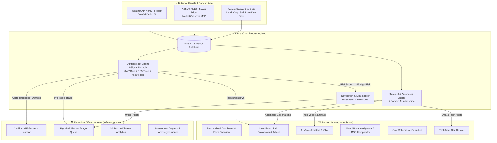
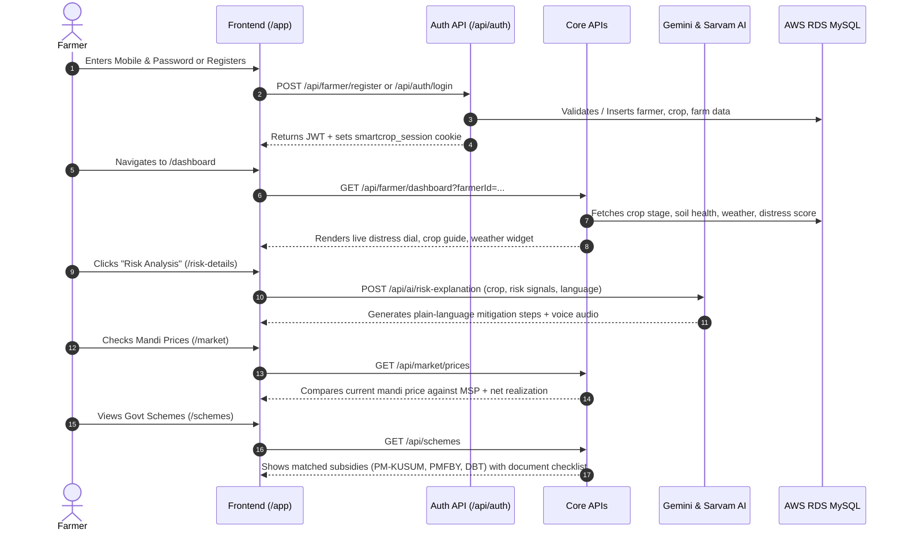
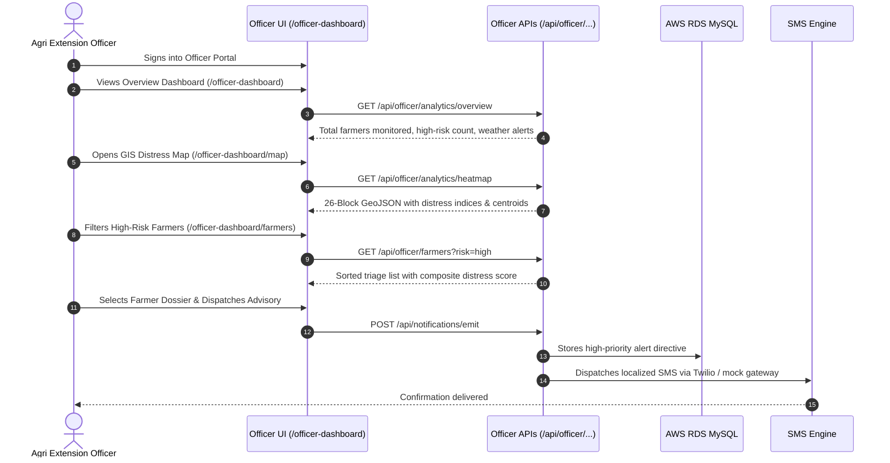
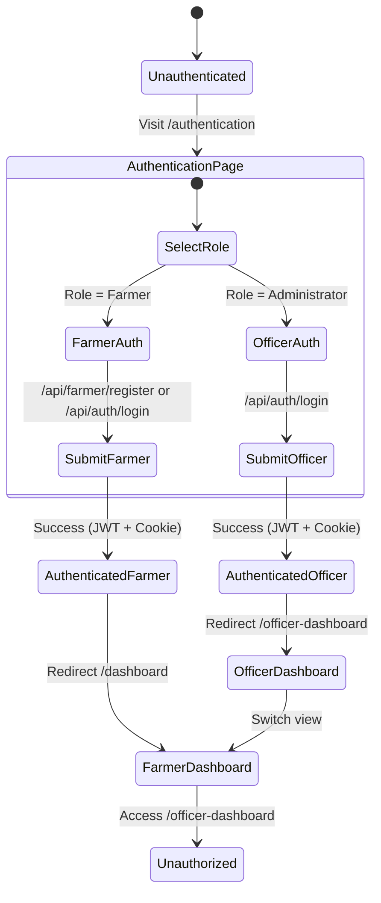

# 🌱 SmartCrop — End-to-End Project Workflow & Architecture

> **Production-grade, Multilingual Crop Advisory & Farmer Distress Early-Warning System**  
> Built for **Smart India Hackathon (SIH)** — **Problem Statement PS-02**.

---

## 📑 Table of Contents

1. [Executive Summary & Core Philosophy](#1-executive-summary--core-philosophy)
2. [End-to-End System Workflow Architecture](#2-end-to-end-system-workflow-architecture)
3. [User Journeys & Operational Workflows](#3-user-journeys--operational-workflows)
   - [A. Farmer User Flow](#a-farmer-user-flow)
   - [B. Agriculture Extension Officer Flow](#b-agriculture-extension-officer-flow)
   - [C. Government / Policy Maker Flow](#c-government--policy-maker-flow)
4. [Data Pipelines & Calculation Engine](#4-data-pipelines--calculation-engine)
   - [Module 1: Smart Crop Advisory Engine](#module-1-smart-crop-advisory-engine)
   - [Module 2: 3-Signal Distress Scorer](#module-2-3-signal-distress-scorer)
5. [Real-time Notification & Alert Dispatch Pipeline](#5-real-time-notification--alert-dispatch-pipeline)
6. [Multilingual (14 Indic Languages) & Low-Bandwidth Workflow](#6-multilingual-14-indic-languages--low-bandwidth-workflow)
7. [Authentication, RBAC & Session Lifecycle](#7-authentication-rbac--session-lifecycle)
8. [Comprehensive Route & Directory Map](#8-comprehensive-route--directory-map)

---

## 1. Executive Summary & Core Philosophy

SmartCrop operates on a **dual-module architectural paradigm** specified by PS-02:
1. **Module 1 (Crop Advisory Engine)**: Takes weather, soil, and crop phenology inputs $\rightarrow$ Outputs actionable, plain-language agronomic directives with voice guidance in the farmer's native tongue.
2. **Module 2 (Distress-Risk Scorer)**: Synthesizes a transparent 3-signal distress index ($0.40 \cdot \text{Rainfall Deficit} + 0.35 \cdot \text{Mandi Price Crash} + 0.25 \cdot \text{Loan Due Date}$) $\rightarrow$ Proactively triggers early alerts and routes interventions to local Agriculture Extension Officers before distress escalates into crisis.

---

## 2. End-to-End System Workflow Architecture



---

## 3. User Journeys & Operational Workflows

### A. Farmer User Flow



1. **Authentication & Onboarding (`/authentication`)**:
   - Farmer enters mobile number, password, crop selection, acreage, soil type, and location.
   - Database creates unified `farmers`, `users`, `farmer_profiles`, `farms`, and `crops` records.
   - JWT authentication session is established.
2. **Daily Command Center (`/dashboard`)**:
   - Displays real-time distress index dial (Low: 0-39, Medium: 40-64, High: 65-100).
   - Shows 7-day weather outlook, soil moisture alerts, crop phenology progress, and upcoming tasks.
3. **Distress Diagnostics (`/risk-details`)**:
   - Sub-factor breakdown: Rainfall deficit, soil moisture depletion, market volatility, loan pressure, pest risk.
   - On-demand Gemini AI agronomic reasoning in the farmer's chosen Indic language.
4. **AI Agronomist Voice Assistant (`/ai-chat`)**:
   - Voice-in, voice-out multilingual assistance powered by Sarvam AI TTS and Google Gemini 2.5.
5. **Market & Mandi Intelligence (`/market`)**:
   - Real-time mandi rates vs. Government Minimum Support Price (MSP).
   - Net Realization Calculator (Price - Transportation & Mandi Cess).
6. **Government Schemes & Subsidies (`/schemes`)**:
   - Matches eligible central & state schemes, required documents checklist, and application deadlines.
7. **Actionable Notification Dossier (`/notifications/[id]`)**:
   - Detailed directive explaining what happened, why it matters to the specific plot, and step-by-step resolution.

---

### B. Agriculture Extension Officer Flow



1. **Executive Overview (`/officer-dashboard`)**:
   - District-level macro metrics: Farmers at risk, average distress score, active crop hectarage.
2. **GIS Distress Heatmap (`/officer-dashboard/map`)**:
   - 26-block interactive MapLibre choropleth map color-coded by distress severity.
3. **Priority Triage Queue (`/officer-dashboard/farmers`)**:
   - Ranked list of farmers by vulnerability with instant search by block, village, crop, or loan urgency.
4. **Farmer Detail Dossier (`/officer-dashboard/farmers/[farmerId]`)**:
   - Full diagnostic breakdown: Soil NPK, satellite NDVI, crop stage, debt profile, history of alerts.
5. **Intervention Dispatcher (`/officer-dashboard/interventions`)**:
   - 1-click issuance of official agronomic advisories, emergency relief schemes, or localized SMS alerts.
6. **Analytics Suite (`/officer-dashboard/analytics`)**:
   - 10 comprehensive analytical breakdowns: Market stress, rainfall deviation, risk distribution, factor correlation.

---

## 4. Data Pipelines & Calculation Engine

### Module 1: Smart Crop Advisory Engine
```
Input Parameters:
├── Crop Phenology (e.g. Paddy - Swarna MTU 7029, Flowering Stage)
├── Soil Chemistry (NPK, pH 6.2, Moisture 24%)
├── Weather Signals (14-day rainfall deficit, temperature, humidity)
└── Location (Block: Baripada, District: Mayurbhanj, State: Odisha)
       │
       ▼
Processing & Intelligence Layer:
├── Agronomic Rule Engine (Thresholds for drought, pest, nutrition)
├── Alternative Crop Matrix (Drought-tolerant pulses/millets recommendation)
└── Gemini 2.5 Generative Logic (Localized plain-language explanations)
       │
       ▼
Output:
└── Directives with exact per-acre intervention dosages in 14 Indic languages.
```

---

### Module 2: 3-Signal Distress Scorer (`lib/distress-scorer.ts`)

$$\text{Composite Distress Score} = (0.40 \times \text{Rainfall Deficit Score}) + (0.35 \times \text{Market Crash Score}) + (0.25 \times \text{Loan Due Date Score})$$

| Signal | Weight | Formula / Rules | High Risk Threshold |
|---|---|---|---|
| **Rainfall Deficit** | **40%** | $\text{Deficit \%} = \frac{\text{Historical Normal} - \text{Observed}}{\text{Historical Normal}} \times 100$ | Deficit $\ge 30\%$ |
| **Market Price Crash** | **35%** | $\text{Crash \%} = \frac{\text{Government MSP} - \text{Mandi Modal Price}}{\text{Government MSP}} \times 100$ | Mandi price $\ge 20\%$ below MSP |
| **Loan Due Date Proximity** | **25%** | $100 - \left(\frac{\text{Days Remaining}}{90} \times 100\right)$ (if unpaid) | Due date $\le 15$ days |

**Classification Tiers**:
- 🟢 **LOW RISK (0 – 39)**: Normal routine monitoring.
- 🟡 **MEDIUM RISK (40 – 64)**: Preventive advisory issued; watchlist status.
- 🔴 **HIGH RISK (65 – 100)**: Auto-escalated to Extension Officer triage queue and immediate SMS alert.

---

## 5. Real-time Notification & Alert Dispatch Pipeline

```mermaid
flowchart LR
    Event[Distress Threshold Crossed\nor New Advisory Generated] --> Router[/api/notifications/emit]
    Router --> RDS[(AWS RDS MySQL\nnotifications table)]
    Router --> SMS[Twilio / DLT SMS Gateway]
    Router --> ClientSSE[Client Real-time Polling / SSE]
    
    SMS --> FarmerPhone[Farmer Mobile Phone\nFeature Phone SMS]
    ClientSSE --> FarmerApp[SmartCrop App\nUnread Badge & Audio Narration]
```

1. **Trigger**: An environmental or market threshold triggers an alert.
2. **Ingestion**: `POST /api/notifications/emit` validates payload and inserts into AWS RDS.
3. **Multi-Channel Fanout**:
   - **In-App Dossier**: Available under `/notifications` with read-on-open tracking.
   - **Voice Narration**: Audio synthesizer button reads alert aloud in selected native language.
   - **SMS Fallback**: Sends compact text message to farmer's mobile number for offline reach.

---

## 6. Multilingual (14 Indic Languages) & Low-Bandwidth Workflow

### 14 Indic Languages (0ms Client Dictionary Translation)
- **Languages Supported**: English (`en`), Hindi (`hi`), Odia (`or`), Bengali (`bn`), Telugu (`te`), Tamil (`ta`), Marathi (`mr`), Gujarati (`gu`), Punjabi (`pa`), Kannada (`kn`), Malayalam (`ml`), Assamese (`as`), Urdu (`ur`), Nepali (`ne`).
- **Architecture**: Statically compiled dictionaries in [`lib/translations/`](file:///c:/Users/sugud/OneDrive/Documents/SIH/lib/translations/) enable **0ms instant language switching** without API latency or network calls.
- **Voice Synthesis**: Real-time Indic voice integration via Sarvam AI API.

### Low-Bandwidth Mode (2G Lite Mode)
- **Data Saver Toggle** ([`components/DataSaverToggle.tsx`](file:///c:/Users/sugud/OneDrive/Documents/SIH/components/DataSaverToggle.tsx)):
  - Disables heavy background blur filters and canvas animations.
  - Replaces SVG and Recharts charts with compact accessible data tables in Mandi Market and Officer Analytics.
  - Lowers API payload sizes via `?lite=true` parameters and activates `fetchWithCache` `localStorage` caching.

---

## 7. Authentication, RBAC & Session Lifecycle



- **JWT Signing**: Cryptographically signed HMAC-SHA256 tokens generated via [`lib/auth-jwt.ts`](file:///c:/Users/sugud/OneDrive/Documents/SIH/lib/auth-jwt.ts).
- **Session Persistence**: Dual-layer storage via `smartcrop_token` (HTTP cookie) and `smartcrop_session` (`localStorage`).
- **Route Protection**: Reverse proxy / Next.js middleware guards protected routes (`/dashboard`, `/officer-dashboard`, `/risk-details`).

---

## 8. Comprehensive Route & Directory Map

### Frontend Pages

| URL Route | Role | Description & Purpose |
|---|---|---|
| `/` | Public | Landing page & portal selector |
| `/authentication` | Public | Glassmorphic unified login & registration (Farmer & Officer) |
| `/dashboard` | Farmer | Farmer Command Center: Distress dial, weather, crops, soil |
| `/risk-details` | Farmer | Multi-factor risk breakdown & Gemini AI agronomic reasoning |
| `/crop-monitoring` | Farmer | Real-time NDVI, moisture, and pest sensor monitoring |
| `/crop-details` | Farmer | Comprehensive guide on active crop varieties and management |
| `/alternative-crop` | Farmer | Drought/market resilient alternative crop recommendations |
| `/market` | Farmer | Mandi prices, MSP comparison & transport net realization |
| `/schemes` | Farmer | Central/State subsidy finder & document eligibility checklist |
| `/ai-chat` | Farmer | 14-language AI Voice Agronomist powered by Sarvam & Gemini |
| `/notifications` | Farmer | Notification center with priority filtering |
| `/notifications/[id]` | Farmer | Deep-dive Alert Dossier with action directives |
| `/farmer-profile` | Farmer | Land holdings, farm boundaries, and personal details |
| `/officer-dashboard` | Officer | Extension Officer Command Center overview |
| `/officer-dashboard/map` | Officer | 26-Block GIS interactive distress heatmap |
| `/officer-dashboard/farmers` | Officer | High-risk farmer triage queue & search |
| `/officer-dashboard/farmers/[id]` | Officer | Detailed farmer diagnostic dossier |
| `/officer-dashboard/interventions` | Officer | 1-click advisory and relief dispatch center |
| `/officer-dashboard/analytics` | Officer | 10-section analytical distress suite |

---

### Backend REST API Endpoints

| Endpoint | Method | Functionality |
|---|:---:|---|
| `/api/farmer/register` | `POST` | Multi-table atomic farmer registration & JWT issuance |
| `/api/farmer/login` | `POST` | Farmer phone/email authentication |
| `/api/farmer/me` | `GET` | Current authenticated farmer profile, farms & crops |
| `/api/farmer/dashboard` | `GET` | Dashboard metrics, risk score, weather & soil stats |
| `/api/ai/risk-explanation` | `POST` | Gemini 2.5 plain-language agronomic risk diagnostic |
| `/api/ai/chat` | `POST` | AI conversational agronomist with Indic voice context |
| `/api/notifications` | `GET` | Paginated notifications & summary counts |
| `/api/notifications/[id]` | `GET`, `PATCH` | Fetch notification detail (read-on-open) & update status |
| `/api/notifications/emit` | `POST` | Dispatch new notification via SMS & DB |
| `/api/officer/analytics/overview` | `GET` | Macro officer metrics & district summary |
| `/api/officer/analytics/heatmap` | `GET` | 26-block GeoJSON distress mapping |
| `/api/officer/analytics/distress-trend`| `GET` | Historical 6-month distress trajectory |
| `/api/officer/analytics/market-stress` | `GET` | Mandi price volatility & MSP deficit data |
